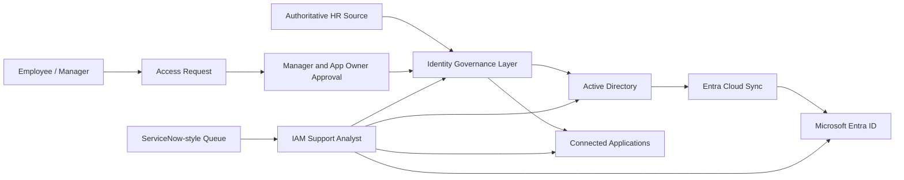

# IAM Support Operations Lab

> A fictional, sanitized identity and access management portfolio demonstrating IAM support, identity lifecycle operations, access troubleshooting, governance, and audit-ready documentation.

**Portfolio owner:** Joshua Dela Cruz  
**Target roles:** IAM Support Analyst, Identity Operations Analyst, Access Management Analyst, IT Systems Support  
**Core platforms represented:** Active Directory, Microsoft Entra ID, SailPoint concepts, ServiceNow-style incident management


## Executive summary

This lab models the IAM support operations of a fictional retail organization called **Northstar Retail Group**. It demonstrates how an IAM support analyst receives requests, verifies identity information, follows approval controls, troubleshoots access failures, documents evidence, escalates safely, and confirms remediation.

The portfolio emphasizes operational judgment rather than tool screenshots. Every case shows:

- Business impact and risk
- Identity verification and authorization boundaries
- A structured troubleshooting sequence
- Evidence collected before escalation
- Root cause and resolution
- Preventive or governance improvements

All identities, tickets, logs, systems, and business data are fictional. No employer information, production screenshots, credentials, secrets, or customer data are included.

## What this portfolio demonstrates

| Capability | Evidence in this repository |
|---|---|
| Joiner-Mover-Leaver lifecycle | Lifecycle runbooks and test identities |
| Active Directory operations | Account state, group membership, lockout, and leaver procedures |
| Microsoft Entra support | MFA and Conditional Access troubleshooting cases |
| SailPoint operations | Aggregation, provisioning, correlation, and certification simulations |
| Access requests | Approval flow, entitlement matrix, and SoD controls |
| Incident management | ServiceNow-style tickets with impact, evidence, resolution, and closure |
| Access governance | Quarterly access review and remediation artifacts |
| Automation | Safety-first PowerShell examples for lab identities |
| Audit readiness | Decision logs, ticket notes, review evidence, and closure criteria |

## Architecture



The lab separates four operational layers:

1. **Authoritative identity data** - fictional HR records provide employee status, department, manager, and lifecycle dates.
2. **Identity governance** - SailPoint-style simulations model aggregation, correlation, requests, approvals, provisioning, and certification.
3. **Directories and applications** - Active Directory and Microsoft Entra ID represent authentication and access-control systems.
4. **Support operations** - ServiceNow-style cases capture investigation, evidence, resolution, escalation, and audit history.

See [architecture and trust boundaries](docs/architecture.md) for the detailed design.

## Featured case studies

### 1. Joiner-Mover-Leaver lifecycle

The lifecycle runbooks show how access should be created, adjusted, and removed using authoritative attributes and approval controls.

- [Joiner runbook](lifecycle/joiner.md)
- [Mover runbook](lifecycle/mover.md)
- [Leaver runbook](lifecycle/leaver.md)

### 2. IAM support incident laboratory

| Case | Scenario | Primary skill |
|---|---|---|
| IAM-001 | Repeated Active Directory lockout | Authentication troubleshooting |
| IAM-002 | SailPoint request completed but access missing | Provisioning investigation |
| IAM-003 | Conditional Access denied a valid user | Entra sign-in analysis |
| IAM-004 | Terminated worker retained a connected account | Security containment |
| IAM-005 | Mover retained incompatible Finance access | Least privilege and SoD |

Open the [support case index](support-cases/README.md) to review the full tickets.

### 3. Access governance

The governance section includes:

- [Role and entitlement matrix](governance/entitlement-matrix.csv)
- [Quarterly access review plan](governance/access-review-plan.md)
- [Sample remediation report](governance/remediation-report.md)

### 4. SailPoint operational simulations

- [Aggregation and correlation](sailpoint-simulation/aggregation-and-correlation.md)
- [Provisioning failure investigation](sailpoint-simulation/provisioning-failure.md)
- [Access certification campaign](sailpoint-simulation/certification-campaign.md)

These documents demonstrate operational concepts and troubleshooting logic. They do not claim SailPoint connector engineering or production workflow development.

## Support methodology

Every IAM issue follows the same disciplined sequence:

```text
Validate identity and authorization
        ↓
Capture the exact error, time, resource, and business impact
        ↓
Check identity and account state
        ↓
Check authentication and policy results
        ↓
Check roles, groups, entitlements, and application assignment
        ↓
Review provisioning, synchronization, and target-system evidence
        ↓
Resolve within authority or escalate with a complete evidence package
        ↓
Confirm access, document closure, and identify preventive action
```

## Safe automation examples

The `scripts` directory contains PowerShell examples designed for an isolated Active Directory lab:

- `New-LabUsers.ps1` creates fictional test users from a CSV file.
- `Disable-LabLeaver.ps1` disables one lab user, removes non-protected group memberships, and records the intended actions.

Both scripts support `-WhatIf`. Review every parameter and run them only in an authorized lab environment.

## Repository map

```text
iam-support-operations-lab/
├── README.md
├── docs/
│   ├── architecture.md
│   ├── operating-model.md
│   └── interview-walkthrough.md
├── lifecycle/
│   ├── joiner.md
│   ├── mover.md
│   └── leaver.md
├── support-cases/
│   ├── README.md
│   ├── IAM-001-account-lockout.md
│   ├── IAM-002-missing-entitlement.md
│   ├── IAM-003-conditional-access.md
│   ├── IAM-004-failed-deprovisioning.md
│   └── IAM-005-mover-access-conflict.md
├── governance/
│   ├── access-review-plan.md
│   ├── entitlement-matrix.csv
│   └── remediation-report.md
├── sailpoint-simulation/
│   ├── aggregation-and-correlation.md
│   ├── provisioning-failure.md
│   └── certification-campaign.md
├── sample-data/
│   └── lab-users.csv
└── scripts/
    ├── New-LabUsers.ps1
    └── Disable-LabLeaver.ps1
```

## Interview walkthrough

For a five-minute interview presentation:

1. Explain the fictional company and architecture.
2. Show the Joiner-Mover-Leaver lifecycle.
3. Walk through IAM-002, the missing-entitlement incident.
4. Explain the access review and remediation evidence.
5. Clearly distinguish production experience from lab simulation.

The complete script is in [docs/interview-walkthrough.md](docs/interview-walkthrough.md).

## Scope and ethical statement

This repository is a learning and portfolio environment. It is not a production IAM implementation and does not contain proprietary configurations. Product names are used only to explain broadly applicable identity-support concepts. Any screenshots added later should show fictional identities and sanitized tenant information.

## Future enhancements

- Add an isolated Windows Server and Active Directory demo
- Add Microsoft Entra sign-in log samples with fictional data
- Add SCIM request and response examples
- Add a lightweight access-request workflow application
- Add automated validation of lifecycle test cases
- Add a dashboard summarizing IAM ticket categories and SLA outcomes

## Contact

- Portfolio: https://joshuadelacruz.solutions/
- LinkedIn: https://www.linkedin.com/in/joshua-l-dela-cruz/
- GitHub: https://github.com/joshua-l-delacruz

## Contributing

Corrections and improvements to the fictional lab material are welcome. See [CONTRIBUTING.md](CONTRIBUTING.md). Never submit employer data, production screenshots, credentials, tenant identifiers, or real identity records.

## License

No open-source license has been selected yet. Copyright remains with the repository owner unless a license is added.

