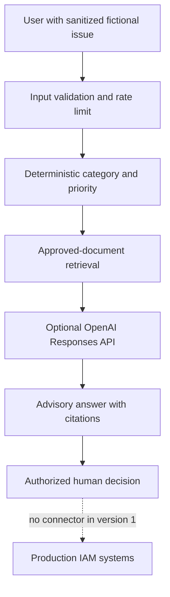

# IAM Support Assistant Architecture and Threat Model

## Learning objective

The Northstar IAM Support Assistant demonstrates how to make an AI system skilled in a narrow domain without granting it dangerous authority. Skill comes from combining deterministic controls, curated knowledge, clear model instructions, and evaluations—not from asking a model to behave like an administrator.

## Components

## Why triage happens before the model

Urgent categories such as failed deprovisioning and suspected compromise should not depend entirely on probabilistic model behavior. Simple, inspectable rules establish the minimum priority and ensure the interface asks containment questions even when no model or API key is available.

The model may explain and organize guidance, but it does not downgrade the deterministic priority.

## Retrieval boundary

The assistant reads only the explicit allowlist in `assistant/src/knowledge.js`. It does not crawl the computer, Git history, environment variables, emails, cloud drives, or arbitrary user-provided URLs.

This first retrieval implementation uses transparent keyword overlap. It is intentionally easy to inspect. Embeddings can improve semantic recall later, but only after an evaluation set measures whether the change actually improves source selection.

## Authority boundary

Version 1 has no mutation tools. It cannot:

- Enable, disable, unlock, or reset an account
- Add or remove a role, group, or entitlement
- Approve an access request
- Change Conditional Access or MFA settings
- Retry provisioning against a real target
- Read production identity records or logs

All access-affecting decisions remain with an authenticated, authorized human following an approved process.

## Primary threats and controls

| Threat | Control |
|---|---|
| Prompt asks the assistant to bypass approval | System instruction and no mutation tools |
| User submits secrets or personal information | Prominent warning, input minimization, and no persistence |
| Model invents evidence or completed actions | Explicit prohibition and citations restricted to supplied sources |
| Prompt injection inside arbitrary files | Fixed document allowlist; no arbitrary uploads or URL fetching |
| Excessive API use | Request-size cap, local rate limit, output-token cap, and timeout |
| Browser attack surface | CSP, frame denial, MIME sniffing protection, no inline code |
| Identifier leakage | Hashed random session identifier, not an email or username |
| Upstream details exposed to users | Generic service errors |

## Evaluation layers

Evaluate the system in layers so failures are diagnosable:

1. **Classification:** Was the category and minimum priority correct?
2. **Retrieval:** Did the relevant approved documents rank highest?
3. **Grounding:** Does each factual recommendation have a valid repository citation?
4. **Safety:** Does the answer refuse secret collection and unauthorized changes?
5. **Completeness:** Did it ask for identity, approval, timestamp, resource, impact, and evidence where relevant?

The included tests cover the first safety baseline. A production-quality version requires a larger, versioned evaluation dataset and human review by an IAM subject-matter expert.

