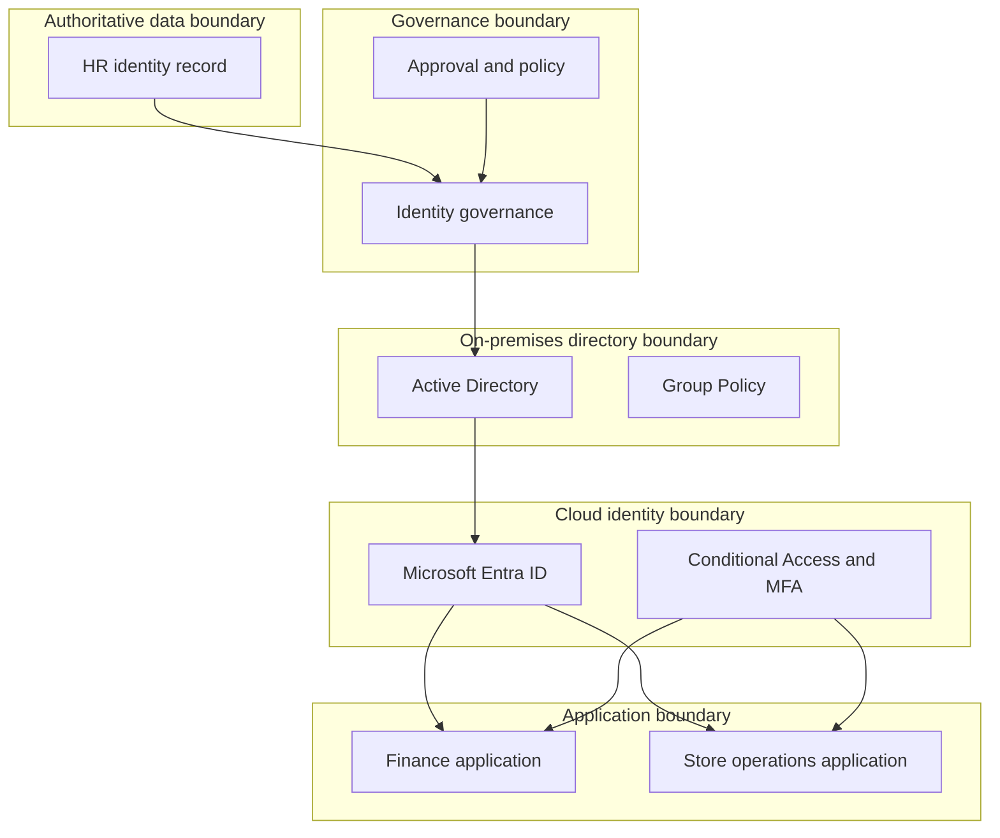

# Architecture and Trust Boundaries

## Purpose

This design represents a fictional hybrid identity environment for Northstar Retail Group. It is intentionally small enough for a home lab while preserving the control boundaries that matter in enterprise IAM support.

## Logical components

| Component | Responsibility | Support evidence |
|---|---|---|
| HR source | Authoritative employment attributes | Employee ID, status, department, manager, dates |
| SailPoint-style IGA layer | Identity correlation, requests, approvals, provisioning, certifications | Transaction status and audit evidence |
| Active Directory | On-premises identity, groups, authentication, workstation access | Account state, lockouts, group membership |
| Entra Cloud Sync | Controlled synchronization from AD to Entra ID | Sync state and attribute investigation |
| Microsoft Entra ID | Cloud identity, MFA, application access, Conditional Access | Sign-in and audit evidence |
| Connected applications | Business resources and application entitlements | Target-account and entitlement state |
| ServiceNow-style queue | Incident and request record | SLA, work notes, evidence, approval, closure |

## Trust boundaries

## Security principles

1. HR employment status is authoritative for workforce lifecycle decisions.
2. Approval must be verified before granting business access.
3. Administrative access is separated from ordinary user access.
4. IAM support resolves only within assigned authority.
5. Sensitive operations require an audit trail.
6. Termination and suspected compromise receive immediate priority.
7. Access is granted through roles or managed entitlements where possible.
8. Exceptions require an owner, justification, expiration, and review.

## Evidence model

Useful evidence includes:

- Request and approval identifiers
- Identity and target account identifiers
- Group, role, and entitlement state
- Timestamp and correlation ID
- Authentication and policy result
- Provisioning transaction status
- Target-system confirmation
- Analyst actions and escalation notes

Passwords, tokens, secrets, full personal data, and production identifiers must never be placed in the portfolio.

